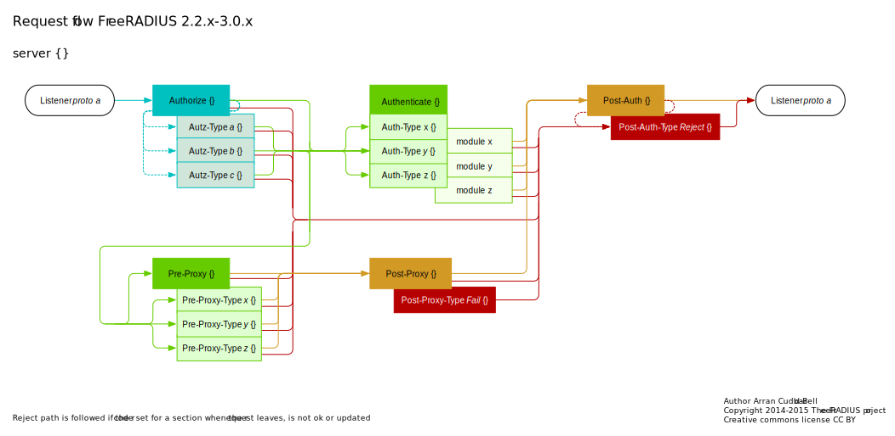

# RADIUS Server with Freeradius

## Useful links
- [https://freeradius.org/](https://freeradius.org/)
- [https://wiki.freeradius.org/guide/Concepts](https://wiki.freeradius.org/guide/Concepts)
- [https://wiki.freeradius.org/guide/Getting-Started](https://wiki.freeradius.org/guide/Getting-Started)


# Introduction to RADIUS, EAP, and AAA Standards

If you are new to RADIUS, EAP, or AAA (Authentication, Authorization, and Accounting) in general, it is recommended to familiarize yourself with the following standards:

- [RFC 2865](https://datatracker.ietf.org/doc/html/rfc2865): Remote Authentication Dial In User Service (RADIUS)
- [RFC 2866](https://datatracker.ietf.org/doc/html/rfc2866): RADIUS Accounting

If you are working with EAP, additional standards include:

- [RFC 3748](https://datatracker.ietf.org/doc/html/rfc3748): Extensible Authentication Protocol (EAP)
- [RFC 3579](https://datatracker.ietf.org/doc/html/rfc3579): RADIUS (Remote Authentication Dial In User Service) Support For Extensible Authentication Protocol (EAP)

These standards provide a solid foundation in RADIUS and EAP at a protocol level.


# Understanding RADIUS Operation



## RADIUS Authentication Request

In RADIUS, the client initiates the communication by sending a RADIUS authentication request to the server. It's important to note that the client determines the content of the request.

## Auth-Type Selection - `authorize {}`

Upon receiving the request, the RADIUS server evaluates its capability to handle the request. This determination relies on the authentication types enabled in the server, database lookup capabilities, and the content of the request.

The server proceeds to query modules within the authorize section:

- Unix module, can you handle this one?
- Pap module, can you handle this one?
- Mschap module, can you handle this one?

The modules examine the request for key attributes, such as MS-CHAP-Challenge (for mschap), CHAP-Challenge (for chap), or EAP-Message (for eap). If a module recognizes relevant information, it signals its ability to take action.

When a module identifies recognizable attributes, it declares its capability to handle the request. The module may state:
```plaintext
"I can't authenticate this user now (I was just told to authorize them), but my pal in the Authenticate section can! Hey, set the Auth-Type to me!"
```
If a module doesn't find any recognizable information or deems no lookup necessary, it remains inactive.

### Understanding Auth-Type in RADIUS

The `Auth-Type` is a variable used in the context of the RADIUS (Remote Authentication Dial-In User Service) server to indicate the type of authentication that should be performed for a specific user or authentication request. Essentially, it is a way for the server to determine which specific authentication method should be applied for a particular user.

When the RADIUS server receives an authentication request from the client, the server seeks to determine which authentication module (such as the Unix, Pap, or Mschap modules mentioned) can handle the request. When one of these modules identifies something in the request that it can handle (such as specific attributes like MS-CHAP-Challenge or CHAP-Challenge), it communicates to the server to set the `Auth-Type` to itself. This means that the module recognizing the specific attribute is responsible for authenticating that user.

The use of `Auth-Type` provides flexibility to the RADIUS server to dynamically adapt to various supported authentication methods, allowing it to choose the appropriate module based on the characteristics of the authentication request.


## User Authentication Process - `authenticate {}`

After the authorization process, the server checks whether anything has set the `Auth-Type`. If nothing has, the server immediately rejects the request.

Let's consider a scenario where the client sends a request with a `User-Password` attribute, and the PAP (Password Authentication Protocol) is enabled. In this case, the PAP module would have set `Auth-Type = pap`.

In the `authenticate` phase, the server calls the PAP module again, checking:
```plaintext
"I see a `User-Password`, which is what the user entered. That's nice, but I need to compare it with something. Ah! Another module added the 'known good' password for this user in the authorize section!"
```
The server then compares the locally stored "known good" password with the password entered by the user. This is the fundamental process of authentication.

Importantly, the "known good" password comes from another module. The PAP module specifically handles PAP authentication and nothing more. The advantage of this approach is that the "known good" password can be sourced from various sources such as the 'users' file, SQL, LDAP, /etc/passwd, an external program, and more—virtually anything.

Suppose the LDAP module was listed in the authorize section. It will have executed and checked:
```plaintext
"Hmm... Can I find a 'known good' password for this user?"
```
If successful, the LDAP module would have added the "known good" password to the request, enabling another module in the `authenticate` phase to use it.

### EAP and LEAP interaction

We discussed the interaction between EAP (Extensible Authentication Protocol) and LDAP (Lightweight Directory Access Protocol) in the context of FreeRADIUS. EAP is a framework for authentication, while LDAP is a protocol used to access and manage directory information. In FreeRADIUS, LDAP can be employed as a module to retrieve user credentials during the authentication process.
Specifically, when a module like LDAP is "listed" in FreeRADIUS configuration, it means that it is included in the sequence of modules executed during the authentication or authorization process. This listing determines the order in which modules are executed.

If you want to configure FreeRADIUS to use LEAP (Lightweight Extensible Authentication Protocol) instead of the default user authentication method, you can modify the eap.conf file. LEAP is a wireless authentication protocol developed by Cisco. Ensure that LEAP is enabled and configure the shared secret in the eap.conf file. Additionally, restart the FreeRADIUS server after making these changes.

In summary, FreeRADIUS allows flexibility in authentication methods through modules like LDAP, and LEAP can be configured as the authentication protocol for wireless connections. The configuration involves specifying modules in the appropriate sections and ensuring that the necessary protocols and secrets are enabled and set.

## Insufficient Information

Let's analyze the process when there is not enough information.

If the client's request, for example, contains an MSCHAP (Microsoft Challenge Handshake Authentication Protocol) request, the behavior of the RADIUS server depends on the available information.<br>
The server's response is contingent on the capabilities of the MSCHAP module.

1. The `mschap` module examines the request, identifying MS-CHAP attributes. It sets the `Auth-Type` to itself (`mschap`).
2. A database module (e.g., LDAP) retrieves the "known good" password and appends it to the request.
3. The `mschap` module is then executed for authentication. It searches for either a clear text password or an NT-hash (as per the protocol table).
4. If the required information hasn't been provided by the datastore, the `mschap` module reports:
    ```plaintext
    Sorry, I can't authenticate the user because I don't have the information I need to validate MSCHAP.
    ```
